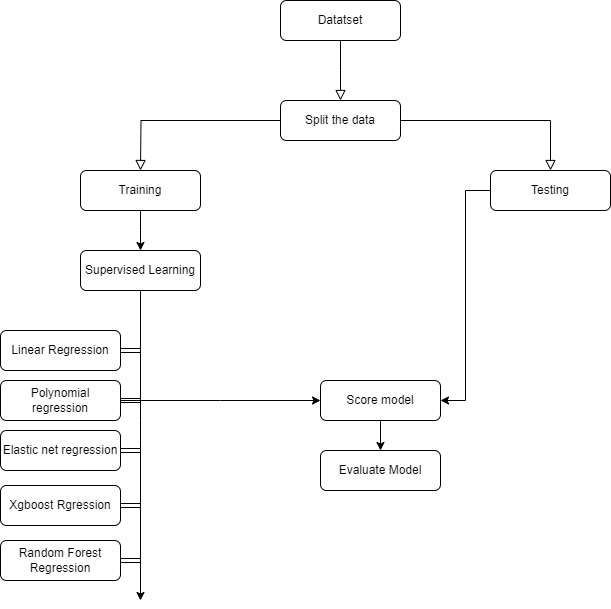
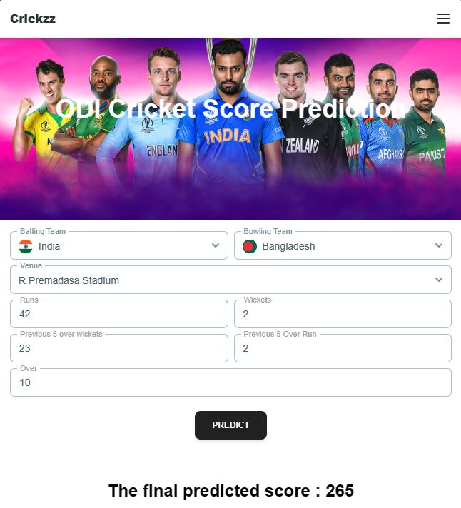

# Cricket Score Prediction using Machine Learning

## Acknowledgements

The purpose of this study is to develop a
method for predicting game outcomes during an ODI cricket
competition. Like all other papers we adopted the factor based
prediction meaning the prediction will depend on various game
factor.
## Algorithms

- Linear Regression
- Polynomial Regression
- ElasticNet Regression
- Xgboost and Random Forest
## Screenshots

## 🔗 Links
[Frontend](https://github.com/sunnysakib/Cricket-score-prediction-machine-learning)

